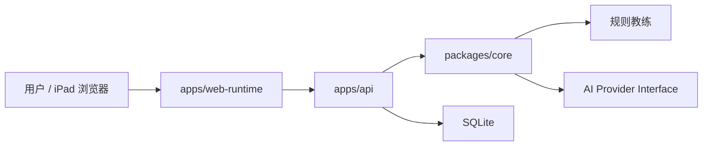

<div align="center">
  
  <h1>fox</h1>
  <p><strong>本地优先的个人生活助手，当前以健身训练主持为第一条主线。</strong></p>
  <p>
    <a href="https://github.com/li1fang/fox/blob/main/LICENSE"></a>
    
    
  </p>
</div>

## 项目简介

fox 是一个综合个人助手项目，目标是把饮食、医疗、健身、记账等日常记录变成一个可追溯、可复盘、可被 AI 辅助分析的个人生活日志系统。

当前阶段采用 **健身优先**：先做一个可靠的训练 runtime，让用户可以在本地浏览器中完成一次完整训练闭环，包括计划、倒计时、反馈、动态调整和总结确认。

fox 的核心边界很明确：

- AI 负责计划、建议、鼓励、解释和总结草稿。
- 状态推进、计时器、危险停止和最终落库由确定性程序控制。
- 当前不追求自动感知，不做姿态识别，不运行本地大模型。

## 当前能力

- 本地 Web Runtime UI：check-in、计划确认、动作执行、组后反馈、休息倒计时、总结确认。
- SQLite 持久化：保存 session、event log 和 confirmed fitness Entry。
- 训练状态机：覆盖 `idle`、`awaiting_approval`、`active_exercise`、`feedback`、`rest_timer`、`summary_pending`、`confirmed` 等状态。
- 规则教练：睡眠差、疲劳高、没跟上、太轻松、疼痛等场景有确定性处理。
- 器材档案：家庭健身房器材可以编辑，并进入计划草稿上下文。
- 历史推荐：根据 confirmed 训练记录推荐同动作重量和次数。
- AI 接口地基：已有 provider、schema 校验、fallback 和 audit，等待接入真实大模型。

## 快速开始

要求：

- Node.js 22+，推荐使用当前 LTS 或更新版本。
- npm 10+。

```bash
npm install
npm run dev
```

默认服务：

- Web Runtime: `http://localhost:5177`
- API: `http://localhost:4177`

常用命令：

```bash
npm run verify
npm run typecheck
npm run test
npm run test:e2e
npm run build
```

## Monorepo 结构

```text
fox/
  apps/
    api/                 # 本地 HTTP API、SQLite repository、端点测试
    web-runtime/         # React 训练运行界面
  packages/
    core/                # 训练状态机、规则教练、AI 边界、计划推荐
    schemas/             # schema 包入口
  docs/                  # 产品、架构、健身模块设计文档
  schemas/               # Entry 与领域 payload JSON Schema
```

## 系统设计

fox 当前采用本地优先架构：



第一版不是自由 agent，而是“确定性 runtime + AI 建议层”：

- runtime 控制训练状态、计时、落库和安全边界。
- AI provider 只返回结构化建议。
- validator 校验 AI 输出，不合法时回退到规则教练。

## 文档入口

核心文档：

- [项目愿景](docs/vision.md)
- [产品简报](docs/product-brief.md)
- [系统架构](docs/architecture.md)
- [数据模型](docs/data-model.md)
- [自动化流水线](docs/automation.md)
- [开发路线图](docs/development-roadmap.md)

健身模块：

- [健身产品设计](docs/fitness/fitness-product.md)
- [训练主持循环](docs/fitness/coach-loop.md)
- [训练状态机](docs/fitness/state-machine.md)
- [AI 边界](docs/fitness/ai-boundary.md)
- [训练运行界面设计](docs/fitness/training-runtime-ui.md)
- [大模型介入接口复查](docs/fitness/llm-integration-review.md)
- [初始用户档案](docs/fitness/user-profile.md)
- [2024 旧训练记录整理](docs/fitness/recovered-2024-log.md)

Schema：

- [统一 Entry schema](schemas/entry.schema.json)
- [领域 payload schema](schemas/domain-payloads.schema.json)
- [schema 示例](schemas/examples.md)

## 当前非目标

- 不做姿态识别或自动计数。
- 不做 3D 形象。
- 不做语音交互。
- 不运行本地大模型。
- 不做全自动记账导入。
- 不做医疗诊断或自动用药决策。

## 路线图

近期重点：

1. 选择真实大模型 provider，并完成 plan draft / feedback / adjustment / summary 接入。
2. 设计计划讨论流程，让 AI 能在训练前和用户确认器材、目标和限制。
3. 完善用户档案、动作库和历史表现摘要。
4. 打磨 iPad 体验，逐步向 PWA 或原生 iPad App 过渡。
5. 后续再设计 ASR/TTS、传感器和姿态识别。

## 开源协议

fox 使用 [MIT License](LICENSE) 开源。

本项目仍是早期原型，健身和医疗相关内容只用于个人记录与辅助提醒，不构成专业建议。
